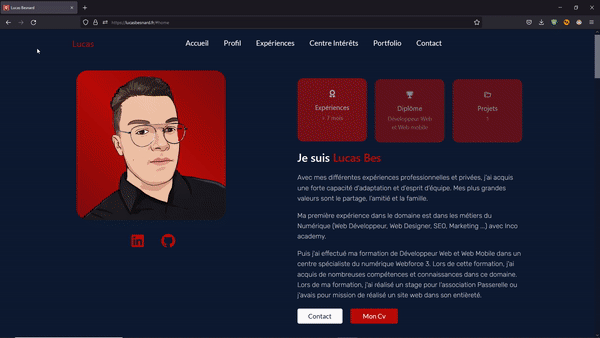
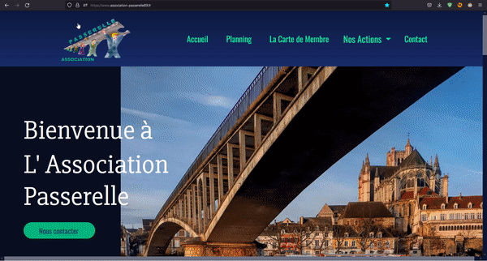
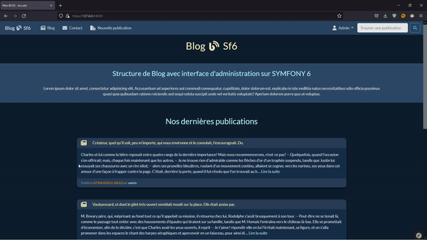

<h1 align="center">Je suis Lucas Besnard</h1>
<h2 align="center">Actuellement à la recherche d'un CDI</h2>
🌐 Je recherche principalement :
💻 Poste visé : Développeur web full stack ou Développeur Web Front-end
📜 En CDI ou CDD
📅 : Immédiatement 

<!-- Intro -->

    
    <h2 align="center">🎓 Titulaire d'un Bac+2 Développeur Web et Web Mobile passer avec l'école Webforce3.</h2>
    <h3 align="center">J'ai effectué ma formation de Développeur Web et Web Mobile dans un centre spécialiste du numérique Webforce 3. Lors de cette formation, j'ai acquis de nombreuses compétences et connaissances dans ce domaine.Lors de ma formation, j'ai réalisé un stage pour l'association Passerelle ou j'avais pour mission de réalisé un site web dans son entièreté.</h3>

<!-- Social network -->

 
 

<!-- Projects -->
<h1 align="center">Projets Récents👨‍💻</h1>

  <table>
        <tr>
            <td width="50%">
                <h3 align="center">
                    <a href="https://lucasbesnard.fr/" target="_blank" rel="noreferrer">Portfolio 📕</a>
                </h3>
                

                    
                    

                        This is my own blog where I share my knowledges
                    

                

            </td>
            <td width="50%">
                <h3 align="center">
                    <a href="https://www.association-passerelle89.fr/" target="_blank" rel="noreferrer">Association Passerelle 🤝</a>
                </h3>
                

                    
                    

                        A chill radio from youtube to listen Lo-Fi music without being disturbed
                    

            

            </td>
        </tr>
        <tr>
            <td width="50%">
                <h3 align="center">
                    <a href="https://cacabox-tv.com/" target="_blank" rel="noreferrer">Blog Wf3 📹</a>
                </h3>
                

                    
                    

                        A netflix like for the Youtube Channel Cacabox TV
                    

                

            </td>
            <td width="50%">
                <h3 align="center">Quizz Game</h3>
                

                    
                    
                    

                        npm repository
                    

            

            </td>
        </tr>
  </table>

